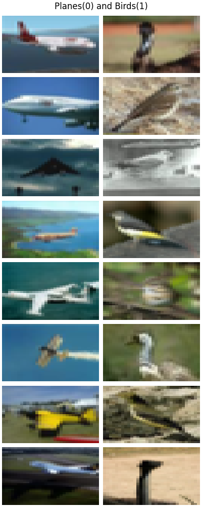
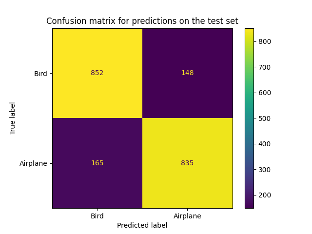
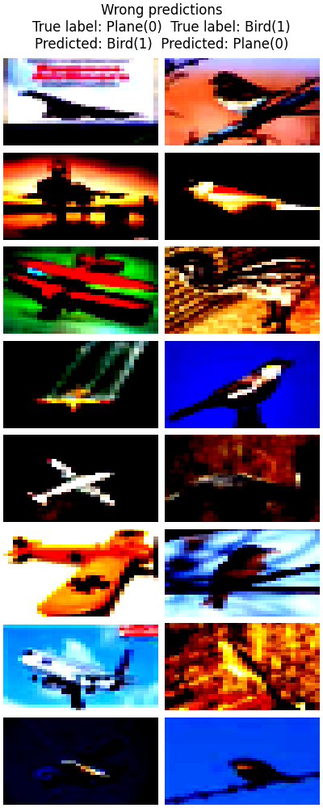

# Introduction
This report aims to explain our approach and design choices for our implementation of gradient descent as part of the neural network training process. Additionally, we answer the questions asked in section 4 of the [project description](docs/INF265_Project_1_Description.pdf).

For general information about the project or how to run the code, please refer to the [README](README.md).

## Contributions
 - **Sebastian Røkholt**: Wrote the implementation of backpropagation, and contributed to model evaluation and writing the report.
 - **Simon Vedaa**: Wrote the training loop, implemented gradient descent with regularization and momentum, did most of the model evaluation and selection and contributed to the report. 

# Approach and Design choices

## Backpropagation
The function ``backpropagation(model, y_true, y_pred)`` is a fully vectorized implementation of the backpropogation algorithm that computes:

- $\frac{\partial L}{\partial w^{[l]}_{i,j}}$ and stores them in the model class' weight attribute ``model.dL_dw[l][i,j]`` for $l \in [1 .. L]$ 
- $\frac{\partial L}{\partial b^{[l]}_{j}}$ and stores them in the model class' weight attribute ``model.dL_db[l][j]`` for $l \in [1 .. L]$ 

The function assumes that ``model`` is an instance of the ``MyNet`` class.

The aim of this implementation is to be functionally equivalent to Pytorch's `loss.backward()` method. It accepts Pytorch Tensors as inputs for `y_true`, `y_pred` and the model's parameters. The backpropagation algorithm is then run directly on Pytorch Tensors without conversion to Numpy arrays. The implementation utilizes the Pytorch matrix multiplication method `.mm()` to calculate $\frac{\partial L}{\partial a}$ and $\frac{\partial L}{\partial w}$, which is very computationally efficient because it takes full advantage of PyTorch's optimized backend operations. 

In accordance with the backpropagation algorithm, we iterate over the layers in reverse order such that the gradients are calculated starting from the output layer and propagated backward through the network. The layer-by-layer approach, coupled with the calculation of the derivative of the activation functions (`model.df[l](model.z[l])`), ensures that the implementation can handle networks with multiple layers and different activation functions.

The optional `verbose` parameter allows for printing debugging information related to the dimensionality of derivatives and matrix multiplications, which helped us troubleshoot the code during the development process and understand how the gradients flow through the network. 

The use of the `torch.no_grad()` context ensures that the gradients are not automatically computed by PyTorch for operations within its scope. This is important to avoid an accumulation of gradient computations that are not necessary for the forward pass or the gradient update step itself.

## Gradient descent

### Setup
- Set seed with value: 265
- Check if cuda is available
- Set default datatype for Pytorch as double
- The MyMLP model architecture is created according to the task description.
Please refer to the README.txt for additional setup guidance. 

### Loading data

The load_CIFAR2 function loads CIFAR10 data with only the labels `airplane` and `bird`. We use the default train/validation split of 90% training data, and 10% validation data.

### Analysis and Preprocessing

Both the analysis and preprocessing was done on the training set.

The class distribution was almost 50/50 with 4529 images of Planes(0) and 4427 images of Birds(0). It is not neccesary to balance the dataset.

The only preprocessing step was normalization, which we performed by utilizing `Pytorch.transforms.Normalize` with the mean and standard deviation of all images in the training set. 

{ height=250px}

### Training

Both training functions follows the same standard procedure for fitting a model. For a given amount of epochs; forward pass through the network to calculate loss, then compute the gradients with backpropagation, then update the parameters with the learning learning rate.

The functions differs in the parameter update step. The train function uses pytorch's `SGD` optimizer while the `train_manual_update` manually implements SGD with optional momentum and weight decay.

### Model comparison

To compare the different implementations, we created the function `compare_training_functions`.
It uses a learning rate of 0.01, weight decay of 0.01, and momentum of 0.09.
Each model is reseeded before training to ensure the same results for 
both training functions.
We compare the training and validation losses, and accuracies with a 5 point precision.

As both implementations should yield the same output, we used Pytorch's `SGD` optimizer
while training with different hyperparameters. This is implemented in the `train_instances` function.

It defines the different hyperparameter combinations, and runs the training function.
The function returns the trained models, along with their validation
accuracies and hyperparameters.

### Model Evaluation

Accuracy is the chosen performance measure. The model with the highest validation accuracy is selected,
and then evaluated on the test set.

In addition we also show the confusion matrix on the test set, and some of the images the model 
failed to correctly classify.

# Q&A

## Backpropagation
**Question A:** *Which PyTorch method(s) correspond to the tasks described in section 2?*

The Pytorch method `loss.backward()` should be functionally equivalent, though it is more efficient. 

**Question B**: *Cite a method used to check whether the computed gradient of a function seems correct. Briefly explain how you would use this method to check your computed gradients in section 2*

Though it might seem like our implementation of backpropagation converges, there might be a logical error that prevents us from reaching an actual minima. Without comparing the calculated gradient to something we know is correct, we don't actually know whether the implementation is converging to an actual minimum. Therefore, we have compared the calculated gradients with the output from Pytorch's `loss.backward()`. Alternatively, we could have used the definition of the derivative to check whether the calculated gradients seem correct. This method is called **gradient checking**. The definition of the derivative is: 

$f'(x) = \frac{f(x + \epsilon) - f(x)}{\epsilon}$, where $\epsilon$ is some small number. 

In the case of backpropagation, the definition could be applied like this: 

$\frac{\partial L}{\partial \theta} = \frac{f(\theta + \epsilon) - f(\theta)}{\epsilon}$, where $\theta$ are the weights and biases for a layer, and $f(\theta)$ is the activation for the same layer. 

So we could, for a subset of the data or a pre-specified layer, compare the results from:
1) Running the backpropagation implementation for parameters $\theta$ and $\theta$ + $\epsilon$
2) Using the definition of the derivative: Set $\epsilon$ to a small number and calculate the result using the formula.

The difference between the two calculations should be less than $\epsilon^2$. Performing these two calculations is very computationally expensive, but it could be useful to debug the training algorithm. At every layer, we could include a gradient checking option that runs the additional computations, does the comparision, and raises an error when the calculated gradient is incorrect. 

## Gradient Descent
**Question C:** *Which PyTorch method(s) correspond to the tasks described in section 3, question 4?*

The step method in the `optimizer` object is equivalent with the manual parameter update.

**Question D:** *Briefly explain the purpose of adding momentum to the gradient descent algorithm.*

The purpose of adding momentum to the gradient descent algorithm is to accelerate convergence. With momentum, the optimizer "remembers" the direction it was previously moving and accumulates the velocity vector across iterations. Additional benefits include less oscillation due to noise or complex loss landscapes, escaping local minima, and improving exploration.

**Question E:** *Briefly explain the purpose of adding regularization to the gradient descent algorithm.*

The purpose of adding regularization is to improve the model's ability to generalize. This is achieved by reducing the model complexity (increasing the bias) by penalizing large weights, thus simplifying the model. 

### Evaluation and Results
**Question F:** *Report the different parameters used in section 3, question 8, the selected parameters in question 9, as well as the evaluation of your selected model.*

Each model is trained for 50 epochs, and has a batch size of 256.
These are all the hyperparameter combinations used in training:

| Learning rate    | Weight Decay    | Momentum    | Training Accuracy | Validation Accuracy |
|---------------- | --------------- | --------------- | -------------- | -----------|
| 0.01    | 0.0    | 0.0    | 0.93 | 0.82|
| 0.01    | 0.01    | 0.0    | 0.92 | 0.82|
| 0.01    | 0.9    | 0.0    | 0.51 | 0.45 |
| 0.01   | 0.0   | 0.01   | 0.94 | 0.83 |
| 0.01   | 0.0   | 0.9   | 0.99 | 0.84 |
| 0.01   | 0.01   | 0.9   | 0.94 | 0.84 |
| 0.01   | 0.9   | 0.01   | 0.51 | 0.45 |

These are the chosen parameters:

| Learning Rate    | Weight Decay    | Momentum    |
|---------------- | --------------- | --------------- |
| 0.01    | 0.0    | 0.9    |

Accuracies of the chosen model:

- Training accuracy: 99%
- Validation accuracy: 84%
- __Test accuracy: 84%__

The confusion matrix on the test data can be found in Figure 2.
And examples of misclassified images in Figure 3.

{ height=200px }

{ height=250px }

\newpage

**Question G:** *Comment your results. In case you do not get expected results, try to give potential reasons that would explain why your code does not work and/or your results differ.*

The chosen model seems to overfit on the training data. To improve generalization, we could reduce the number 
of epochs or apply more regularization. A more exhaustive hyperparameter search, could find a more optimal
hyperparameter combination.

Looking at the confusion matrix, the model seems to perform equally well on both classes.

In Figure 3, images of birds predicted as planes, contains sticks, powerlines or other straight lines
which might resemble the wings of a plane. In the images of planes predicted as birds they could have 
curves that might resemble the contour of a birds body. Another possibilty for the wrong predictions 
could be explained by noise and the low resolution of input images.

